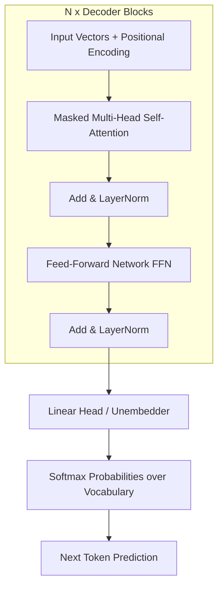

## How LLM Works

Raw Text → Tokenization → Token IDs → Embedding Layer → Embedding Vectors → Neural Network → Output Token IDs → Text
- `Raw Text`, which is broken down into smaller units called Tokens through Tokenization
- Each token is then assigned a unique integer `Token ID` via a lookup table in the tokenizer's vocabulary
- These integer IDs are converted into dense numerical representations known as `Embeddings` through an Embedding Lookup
- This step transforms discrete tokens into` Vectors` (lists of numbers) in a high-dimensional space, where semantically similar tokens are positioned closer together.
- `Positional Encoding` is often added to these vectors to preserve the order of words.
- The resulting Embedding Vectors are fed into the `Neural Network` (typically `Transformer blocks`) to capture context and predict the next token
- Finally, the model generates Output Token IDs, which are converted back into human-readable Text by the tokenizer.

[Deailed Explaination Check This Link](https://www.mlwhiz.com/p/what-is-an-llm-tokens-embeddings)
|  |  |
| :---: | :---: |
|  |  |      


### 1. Tokenization: From Text to Numbers
Language models do not process raw text; they operate on integers called Tokens.   
`Tokenization` is the process of breaking text into sub-word units using algorithms like `Byte-Pair Encoding (BPE)` or `WordPiece`.
```
+-----------------------+     +-------------------+     +-------------------------+
|     Input Text        | --> |   Tokenizer BPE   | --> |       Token IDs         |
| "Learning Agentic AI" |     | [Learn, ing, ...] |     | [15496, 278, 12041, ...] |
+-----------------------+     +-------------------+     +-------------------------+

```

Key Tokenization Concepts
- `Vocabulary Size` ($V$): The total number of unique tokens the model knows (e.g., `~50,000 for GPT-2/3`, `~100,000+ for modern LLMs`).
- `Token-to-Word Ratio`: On average, $1 \text{ word} \approx 1.3 \text{ tokens}$ (or $\approx 0.75 \text{ words per token}$).
- `Subword Splitting`: Prevents Out-Of-Vocabulary (OOV) errors by breaking rare words into known sub-parts (e.g., unbelievable $\rightarrow$ un + believ + able).

### 2. Vector Embeddings & Positional Encoding
Once text is tokenized into IDs, each token ID is mapped to a high-dimensional continuous vector space ($d_{\text{model}}$).
```
Token ID: 15496  --->  [ Embedding Matrix Lookup ]  --->  [ 0.024, -0.198, 0.854, ..., 0.012 ]  (e.g., 4096 dimensions)
                                                                    +
                                                           [ Positional Encoding ]  (Sinusoidal / RoPE)
                                                                    ||
                                                           [ Transformer Input Vector ]
```
##### Why Positional Encoding?
Unlike Recurrent Neural Networks (RNNs) or LSTMs that process text sequentially, Transformers process all tokens in parallel.

### 3. High-Level Transformer Architecture
The original Transformer architecture (from `"Attention Is All You Need"`) consists of an Encoder and a Decoder.  
Modern Causal LLMs (like GPT-4, LLaMA, and Mistral) are Decoder-Only architectures optimized for autoregressive generation.


